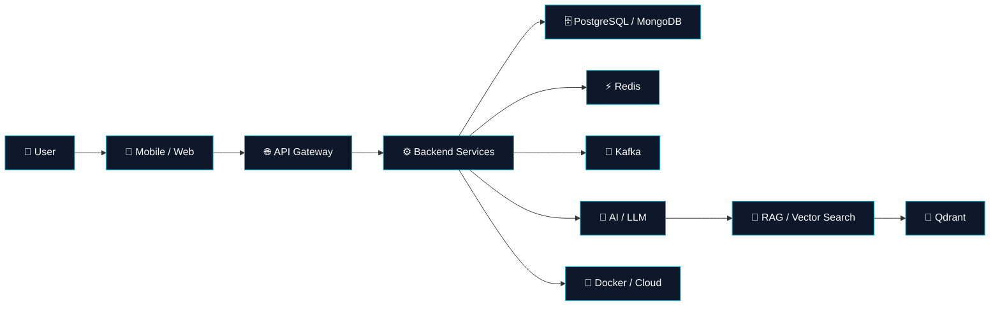

<!-- ========================================================= -->
<!--                 ADEM DEMIR • GITHUB PROFILE                -->
<!-- ========================================================= -->

<div align="center">

<a href="https://github.com/AdemDemirFE">
  
</a>

<br/>


<br/>

<a href="https://github.com/AdemDemirFE">
  
</a>
<a href="https://github.com/AdemDemirFE?tab=followers">
  
</a>
<a href="https://github.com/AdemDemirFE?tab=repositories">
  
</a>

</div>

---

<div align="center">

### `> whoami`

**Senior Software Development Specialist • Full Stack Developer • Mobile Engineer • AI Enthusiast**

I build production-oriented applications across **backend, web, mobile, cloud and AI** — with a strong focus on architecture, integration, performance, developer experience and reliable delivery.

</div>

---

## ⚡ About Me

<table>
<tr>
<td width="55%" valign="top">

### 🧠 Engineering Mindset

- 🏗️ Designing **scalable backend architectures**
- 📱 Building **cross-platform mobile applications**
- 🌐 Developing modern **web experiences**
- 🔌 Designing and integrating **REST APIs & microservices**
- 🗄️ Working with **relational & NoSQL databases**
- ☁️ Containerizing and deploying applications with **Docker**
- 🤖 Exploring **LLM, RAG, vector search & MCP ecosystems**
- 🧪 Caring about **testing, observability, security and production readiness**
- 🎨 Turning technical complexity into intuitive UX

</td>
<td width="45%" valign="top">

### 🎯 Current Focus

```text
┌────────────────────────────────────┐
│                                    │
│  ████████████████████  BACKEND    │
│  ██████████████████░░  MOBILE     │
│  ████████████████░░░░  FRONTEND   │
│  ██████████████░░░░░░  CLOUD      │
│  ███████████████░░░░░  AI / RAG   │
│  ████████████░░░░░░░░  DEVOPS     │
│                                    │
└────────────────────────────────────┘
```

**Currently exploring**

`React` `React Native` `Kubernetes` `Kafka` `Microservices` `RAG` `MCP` `LLM Infrastructure`

</td>
</tr>
</table>

---

## 🧩 Technology Universe

<div align="center">

### Backend


### Frontend & Mobile


### Data & Infrastructure


### AI / Tools / Design


</div>

---

## 🏛️ Architecture Is a Feature



> **My approach:** Build it clean → connect it intelligently → test it seriously → ship it reliably.

---

## 🚀 What I Build

<table>
<tr>
<td align="center" width="25%">

### 📱
**Mobile**

Ionic  
Angular  
Capacitor  
Cordova  
Native integrations

</td>
<td align="center" width="25%">

### ⚙️
**Backend**

Java  
Spring Boot  
.NET  
REST APIs  
Microservices

</td>
<td align="center" width="25%">

### ☁️
**Cloud & DevOps**

Docker  
Kubernetes  
CI/CD  
Linux  
Observability

</td>
<td align="center" width="25%">

### 🤖
**AI Systems**

LLM  
RAG  
Vector DB  
MCP  
AI orchestration

</td>
</tr>
</table>

---

## 🔥 Featured Engineering Areas

<div align="center">

| Area | Technologies |
|---|---|
| **Backend Engineering** | Java • Spring Boot • .NET • Node.js |
| **Frontend** | Angular • React • TypeScript • JavaScript |
| **Mobile** | Ionic • Capacitor • Cordova • Android / iOS |
| **Databases** | PostgreSQL • Oracle • MongoDB • Redis |
| **Messaging** | Kafka • Event-driven architectures |
| **Infrastructure** | Docker • Kubernetes • Linux |
| **AI** | LLM • RAG • Qdrant • LiteLLM • Ollama • MCP |
| **Engineering Tools** | Git • GitHub • Postman • Figma |

</div>

---

## 🧪 Engineering Principles

```text
              ┌───────────────────────────────┐
              │       SOFTWARE QUALITY        │
              └───────────────┬───────────────┘
                              │
        ┌─────────────────────┼─────────────────────┐
        ▼                     ▼                     ▼
   PERFORMANCE            SECURITY              DX / UX
        │                     │                     │
        ▼                     ▼                     ▼
   Scalability          Secure APIs          Clean Interfaces
   Caching              Validation            Automation
   Async Work           Least Privilege       Documentation
   Observability        Secure Secrets         Simplicity
        │                     │                     │
        └─────────────────────┼─────────────────────┘
                              ▼
                    🚀 PRODUCTION READY
```

---

## 📊 GitHub Analytics

<div align="center">

<a href="https://github.com/AdemDemirFE">
  
</a>
<a href="https://github.com/AdemDemirFE">
  
</a>

<br/><br/>


<br/><br/>


</div>

---

## 🐍 Contribution Journey

<div align="center">


</div>

---

## 🌌 My GitHub in Motion

<div align="center">


</div>

---

## 💡 Beyond the Code

```javascript
const adem = {
  role: "Senior Software Development Specialist",

  mindset: [
    "Architecture",
    "Automation",
    "Performance",
    "Security",
    "Developer Experience",
    "Continuous Learning"
  ],

  build: [
    "Web Applications",
    "Mobile Applications",
    "Backend Services",
    "Microservices",
    "AI-powered Systems"
  ],

  philosophy:
    "Great software is not only code that works — " +
    "it is software that can evolve."
};
```

---

## 🔭 What I'm Exploring Next

<div align="center">

```text
                    THE NEXT LAYER
                         │
          ┌──────────────┼──────────────┐
          ▼              ▼              ▼
       ☁️ CLOUD       🤖 AI          ⚡ SCALE
          │              │              │
     Kubernetes        RAG           Kafka
     Observability     MCP           Events
     CI/CD             Agents        Distributed
          │              │              │
          └──────────────┼──────────────┘
                         ▼
                  🚀 PRODUCTION AI
```

</div>

---

## 🤝 Let's Connect

<div align="center">

<a href="mailto:adem.demir.fe@gmail.com">
  
</a>
<a href="https://www.linkedin.com/in/ademdemirfe/">
  
</a>
<a href="https://github.com/AdemDemirFE">
  
</a>
<a href="https://www.instagram.com/adem.fe.23/">
  
</a>

<br/><br/>


</div>

<!--
  ╔══════════════════════════════════════════════════════════╗
  ║  Built with curiosity • engineered with intent • shipped ║
  ╚══════════════════════════════════════════════════════════╝
-->
