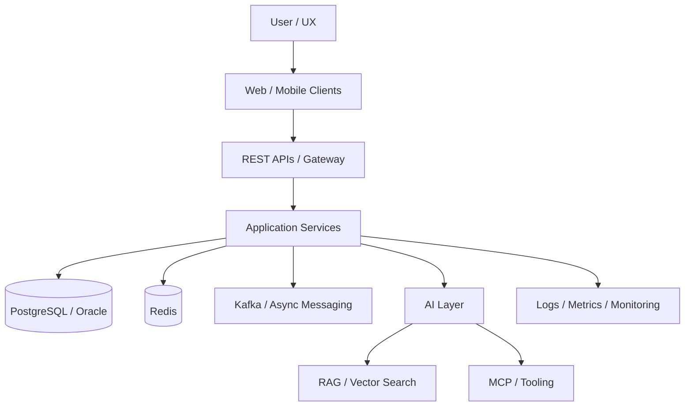

<div align="center">


<br/>

[](https://github.com/AdemDemirFE)
[](https://www.linkedin.com/in/ademdemirfe/)
[](mailto:adem.demir.fe@gmail.com)

> **Build it clean → connect it intelligently → test it seriously → ship it reliably.**

</div>

---

## 🧠 Engineering Mindset

<table>
<tr>
<td width="50%" valign="top">

- 🏗️ Scalable backend architectures
- 📱 Production-ready cross-platform mobile apps
- 🌐 Modern web applications
- 🔌 REST APIs & microservices
- 🗄️ PostgreSQL, Oracle & NoSQL

</td>
<td width="50%" valign="top">

- ☁️ Docker & deployment automation
- 🤖 LLM, RAG, vector search & MCP
- 🧪 Testing & production readiness
- 🔐 Security & observability
- 🎨 Complex systems → clean UX

</td>
</tr>
</table>

---

## 🧩 Technology Universe

### Backend


### Frontend & Mobile


### Data & Infrastructure


### AI / Engineering Tools


---

## 🏛️ Architecture Is a Feature



---

## 📊 GitHub Profile Analytics

> **Self-hosted analytics — zero external stat services.** The SVG cards and the live table below are generated by GitHub Actions directly from the GitHub API and refreshed automatically.

<table>
<tr>
<td width="50%"></td>
<td width="50%"></td>
</tr>
<tr>
<td width="50%"></td>
<td width="50%"></td>
</tr>
</table>

### 📈 Live Metrics

<!-- PROFILE_METRICS:START -->

| Metric | Value |
|---|---:|
| ⭐ Stars received | **6** |
| 🍴 Forks | **0** |
| 📦 Public repositories | **98** |
| 📝 Commits | **161** |
| 🔀 Pull requests | **7** |
| 🐛 Issues | **4** |
| 👀 PR reviews | **0** |
| 🔥 Current contribution streak | **11 days** |
| 🏆 Longest contribution streak | **11 days** |
| 📈 Contributions in current period | **343** |

### 💻 Most Used Languages

- **Java** `37.7%` `████████░░░░░░░░░░░░`
- **TypeScript** `22.6%` `█████░░░░░░░░░░░░░░░`
- **Python** `11.1%` `██░░░░░░░░░░░░░░░░░░`
- **JavaScript** `6.5%` `█░░░░░░░░░░░░░░░░░░░`
- **C** `5.9%` `█░░░░░░░░░░░░░░░░░░░`
- **PHP** `5.4%` `█░░░░░░░░░░░░░░░░░░░`
- **HTML** `2.5%` `█░░░░░░░░░░░░░░░░░░░`
- **Go** `1.7%` `█░░░░░░░░░░░░░░░░░░░`

### 📅 Recent Contribution Activity

- `14 Jun` `░░░░░░░░░░░░░░░░░░░░` **0** contributions
- `21 Jun` `░░░░░░░░░░░░░░░░░░░░` **0** contributions
- `28 Jun` `░░░░░░░░░░░░░░░░░░░░` **0** contributions
- `05 Jul` `░░░░░░░░░░░░░░░░░░░░` **0** contributions
- `12 Jul` `░░░░░░░░░░░░░░░░░░░░` **0** contributions
- `19 Jul` `█░░░░░░░░░░░░░░░░░░░` **1** contributions
- `26 Jul` `█░░░░░░░░░░░░░░░░░░░` **4** contributions
- `02 Aug` `██░░░░░░░░░░░░░░░░░░` **19** contributions
- `09 Aug` `██░░░░░░░░░░░░░░░░░░` **18** contributions
- `16 Aug` `██████░░░░░░░░░░░░░░` **54** contributions
- `23 Aug` `████░░░░░░░░░░░░░░░░` **36** contributions
- `30 Aug` `████████████████████` **189** contributions

_Last updated: 05 Sep 2026 15:17 UTC_

<!-- PROFILE_METRICS:END -->

---

## 🐍 Contribution Snake

<picture>
  <source media="(prefers-color-scheme: dark)" srcset="https://raw.githubusercontent.com/AdemDemirFE/AdemDemirFE/output/github-snake-dark.svg" />
  <source media="(prefers-color-scheme: light)" srcset="https://raw.githubusercontent.com/AdemDemirFE/AdemDemirFE/output/github-snake.svg" />
  
</picture>

---

## ⚡ Current Focus

| Area | Focus |
|---|---|
| 🧠 AI Engineering | LLM · RAG · Vector Search · MCP · AI infrastructure |
| ☕ Backend | Java · Spring Boot · .NET · REST · Microservices |
| 📱 Mobile | Ionic · Angular · Capacitor · Android · iOS |
| 🌐 Frontend | Angular · React · TypeScript |
| ☁️ Cloud / DevOps | Docker · Kubernetes · CI/CD · Linux |
| 📨 Messaging | Kafka · Redis · Event-driven systems |
| 🔐 Quality | Security · Testing · Observability · Production readiness |

---

## 🚀 What I Build

```text
┌──────────────────────────────────────────────────────────────┐
│                       ADEM ENGINEERING                       │
├──────────────────────────────────────────────────────────────┤
│                                                              │
│  WEB ────────────┐                                           │
│  MOBILE ─────────┼──► API / SERVICES ──► DATA               │
│  INTEGRATIONS ───┘          │                  │              │
│                             ├──► CACHE / EVENTS              │
│                             │                               │
│                             └──► AI / RAG / MCP             │
│                                                              │
│                  TEST → OBSERVE → SECURE → SHIP              │
└──────────────────────────────────────────────────────────────┘
```

---

## 🧪 Engineering Principles

- **Architecture before complexity.**
- **Automation before repetition.**
- **Observability before guessing.**
- **Security before production.**
- **Tests before confidence.**
- **Simple interfaces over unnecessary complexity.**
- **A system is successful when it can evolve safely.**

---

## 🤖 AI / RAG / MCP

I am particularly interested in practical AI systems rather than isolated model demos:

`LLM` · `RAG` · `Embeddings` · `Vector Databases` · `Qdrant` · `Redis` · `LiteLLM` · `Ollama` · `MCP` · `Agents` · `n8n` · `AI Infrastructure`

Typical flow:

```text
Documents / APIs
      ↓
Ingestion & Chunking
      ↓
Embeddings
      ↓
Vector Search
      ↓
Retrieval + Context
      ↓
LLM / Agent
      ↓
Tool Calling / MCP
      ↓
Application Response
```

---

## 💡 Beyond the Code

```javascript
const adem = {
  role: "Senior Software Development Specialist",
  build: [
    "Web Applications",
    "Mobile Applications",
    "Backend Services",
    "Microservices",
    "AI-powered Systems"
  ],
  focus: [
    "Architecture",
    "Automation",
    "Performance",
    "Security",
    "Developer Experience"
  ],
  philosophy:
    "Great software is not only code that works — it is software that can evolve."
};
```

---

## 🤝 Let's Connect

<div align="center">

[](https://github.com/AdemDemirFE)
[](https://www.linkedin.com/in/ademdemirfe/)
[](https://www.instagram.com/adem.fe.23/)

📧 **adem.demir.fe@gmail.com**

</div>

---

<div align="center">


**Thanks for visiting my profile.** ⭐

</div>
