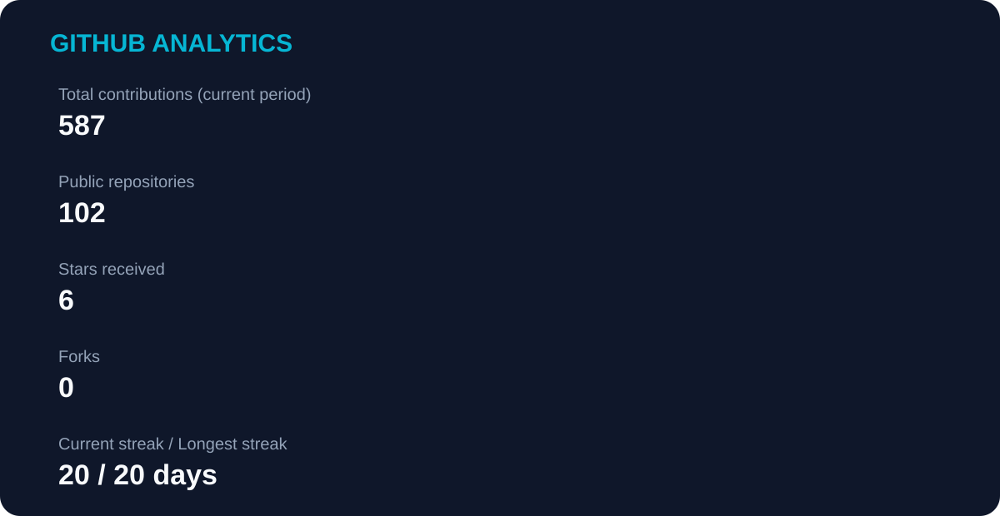
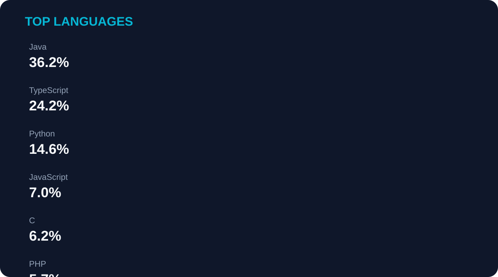
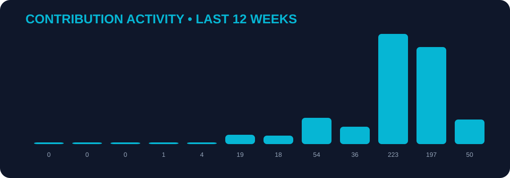
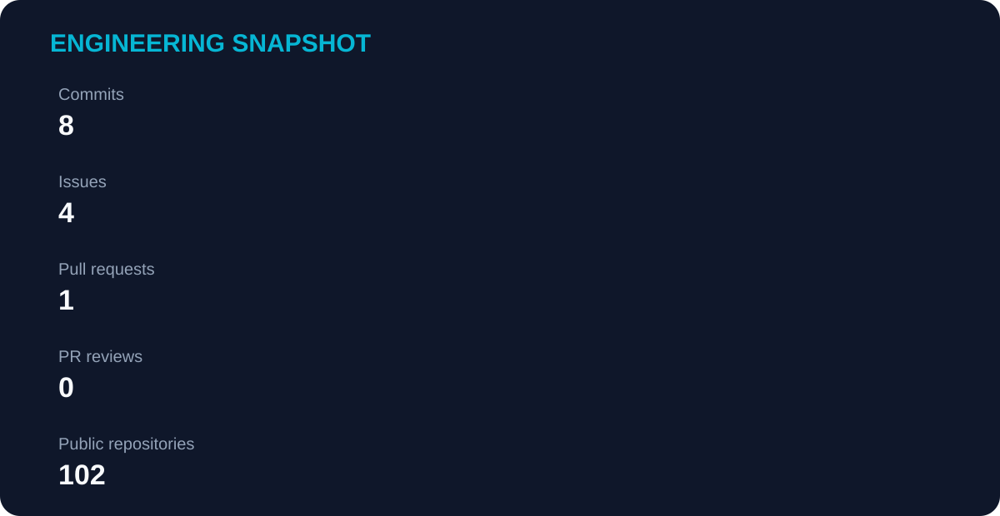

<div align="center">


<br>

<a href="https://github.com/AdemDemirFE">

</a>
<a href="https://www.linkedin.com/in/ademdemirfe/">

</a>

</div>

---

# 👋 Hello, I'm Adem

**Senior Software Development Specialist • Full Stack Developer • Mobile Engineer • AI Enthusiast**

I build production-oriented software across **backend, web, mobile, cloud and AI**, with a focus on architecture, integration, performance, security and developer experience.

---

## 🧠 Engineering Mindset

<table>
<tr>
<td width="50%" valign="top">

- 🏗️ Scalable backend architectures
- 📱 Cross-platform mobile applications
- 🌐 Modern web experiences
- 🔌 REST APIs & microservices
- 🗄️ Relational & NoSQL databases

</td>
<td width="50%" valign="top">

- ☁️ Docker & cloud deployments
- 🤖 LLM, RAG, vector search & MCP
- 🧪 Testing & production readiness
- 🔐 Security & observability
- 🎨 Technical complexity → clean UX

</td>
</tr>
</table>

---

## 🧩 Technology Universe

<div align="center">

### Backend


### Frontend & Mobile


### Data & Infrastructure


### AI / Tools


</div>

---

## 🏛️ Architecture Is a Feature

```text
                    ┌────────────────────┐
                    │      USER / UX      │
                    └─────────┬──────────┘
                              │
                    ┌─────────▼──────────┐
                    │ WEB • MOBILE • API │
                    └─────────┬──────────┘
                              │
                    ┌─────────▼──────────┐
                    │  SERVICES / BACKEND│
                    └────┬────┬────┬─────┘
                         │    │    │
                 ┌───────▼┐ ┌─▼──┐ ┌▼────────┐
                 │Postgres│ │Redis│ │  Kafka  │
                 └────────┘ └────┘ └─────────┘
                         │
                    ┌────▼────────────┐
                    │   AI / LLM      │
                    │ RAG • MCP • DB  │
                    └─────────────────┘
```

> **Build it clean → connect it intelligently → test it seriously → ship it reliably.**

---

# 📊 GitHub Analytics

> **Self-hosted metrics:** These cards are generated inside this repository by GitHub Actions. They do **not** depend on `github-readme-stats.vercel.app`, `github-readme-activity-graph.vercel.app` or `github-profile-trophy.vercel.app`.

<div align="center">



<br><br>



<br><br>



<br><br>



</div>

---

## 🐍 Contribution Journey

<div align="center">

<picture>
  <source media="(prefers-color-scheme: dark)" srcset="assets/github-snake-dark.svg">
  <source media="(prefers-color-scheme: light)" srcset="assets/github-snake.svg">
  
</picture>

</div>

---

## ⚡ Current Focus

```text
BACKEND       ████████████████████
MOBILE        ██████████████████░░
FRONTEND      ████████████████░░░░
CLOUD         ██████████████░░░░░░
AI / RAG      ███████████████░░░░░
DEVOPS        ████████████░░░░░░░░
```

`React` `React Native` `Kubernetes` `Kafka` `Microservices` `RAG` `MCP` `LLM Infrastructure`

---

## 💡 Beyond the Code

```javascript
const adem = {
  role: "Senior Software Development Specialist",
  focus: [
    "Architecture",
    "Automation",
    "Performance",
    "Security",
    "Developer Experience"
  ],
  build: [
    "Web Applications",
    "Mobile Applications",
    "Backend Services",
    "Microservices",
    "AI-powered Systems"
  ],
  philosophy:
    "Great software is not only code that works — it is software that can evolve."
};
```

---

## 🤝 Let's Connect

<div align="center">

<a href="mailto:adem.demir.fe@gmail.com">📧 Email</a>
&nbsp; • &nbsp;
<a href="https://www.linkedin.com/in/ademdemirfe/">LinkedIn</a>
&nbsp; • &nbsp;
<a href="https://github.com/AdemDemirFE">GitHub</a>
&nbsp; • &nbsp;
<a href="https://www.instagram.com/adem.fe.23/">Instagram</a>

<br><br>


</div>
